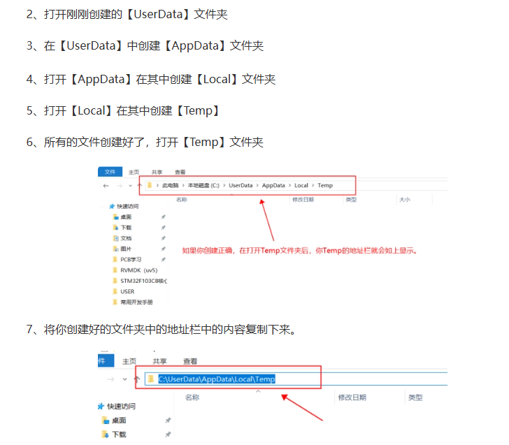

# 编译时报错找不到main.o（日期25.3.6）

报错信息如下：

**..\OBJ\LED.axf: error: L6002U: Could not open file ..\obj\main.o: No such file or directory**

主要就是类似这种报错，找不到main.o或其他各种.o文件。

上网查过，主要有这几种方法

- 更改电脑用户名为英文。在24年电赛配置TI开发板的时候就已经改过了，无效。

- 更换keil5工程设置里的编译器版本。无用

- 检查头文件路径。

<mark>以上方法都没用，最后有效的方法如下：</mark>

[keil编译时报错：error: L6002U: Could not open file .\***\core_cm3.o_百度知道](https://zhidao.baidu.com/question/536159784.html)

在C盘里创建一个文件夹[UserData]，在[UserData]里创建文件夹[AppData]，然后在[AppData]里创建文件夹[Local]，再在[Local]里创建文件夹[Temp]，复制[Temp]文件夹的路径。

电脑设置-搜索“高级系统设置”-高级-环境变量-修改TEMP和TMP的环境变量，改为刚刚复制的[Temp]的路径。修改后如下图。

