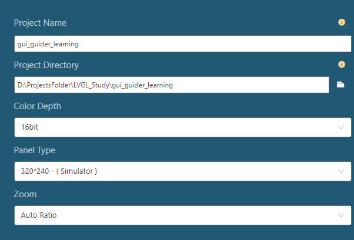
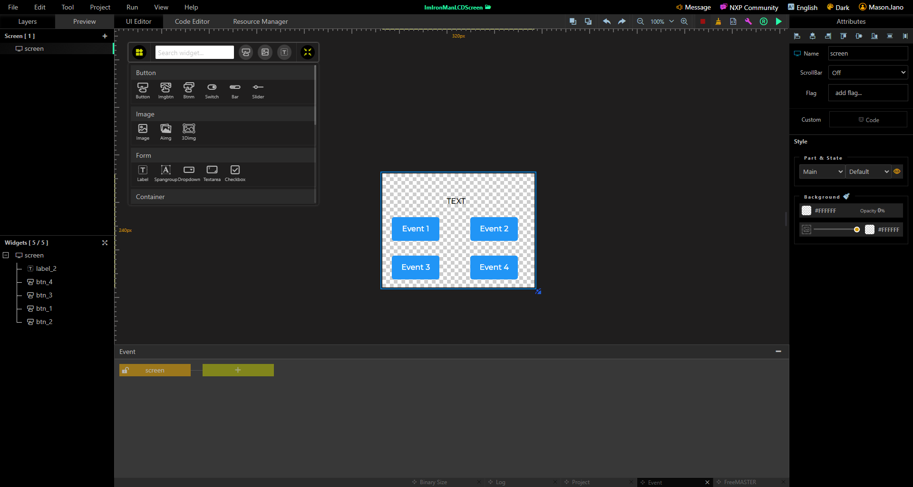
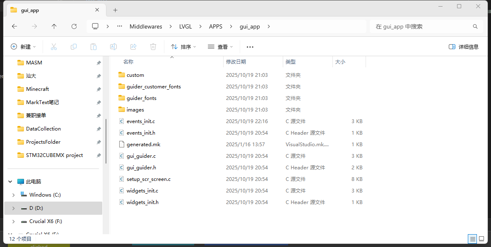

# GuiGuider入门

## 1 创建工程

下载GuiGuider

创建工程，基本无难点。创建工程时"Color Depth"是颜色深度，"panel type"是分辨率。

## 2 绘制UI

页面左侧是工程概览，中间是画布，控件参考GuiGuider使用文档， 常用的有按键事件，可以在GuiGuider中先做好注释，导出代码后，在`events_init.c`中编写事件代码。

## 3 生成代码并移植

点击右上角的Generate Code生成代码，在GuiGuider工程文件里找到custom和generated文件夹。

使用移植模板工程`3 LVGL porting`（移植流程参考[LVGL移植](LVGL移植（无操作系统）.md)），在`3 LVGL porting\Middlewares\LVGL\APPS`下新建文件夹`gui_app`，把`custom`文件夹、`generated`里的所有文件粘贴到`gui_app`中，如图：

然后在KEIL工程中新建一个group`Mid/lvgl/app/gui_group`，然后添加`gui_app`里所有.c和.h文件（包括子文件夹里的），以及添加头文件目录。

## 4 编写事件回调函数

在`event_init.c`里编写。