# LVGL移植（无操作系统）

参考教程

[LVGL快速入门—基于ST M32F407开发板—已完成](https://www.bilibili.com/video/BV1eh4y167JT/?p=2&share_source=copy_web&vd_source=525097c5d02893cf645c1de398ada35d)

## 一、移植前的准备工作

### 1、硬件设备

- 高博士STM32F407VET6开发板

- TFT LCD触控屏

### 2、LVGL代码下载

- LVGL官方代码，github链接

http://github.com/lvgl/lvgl

下载压缩包并解压

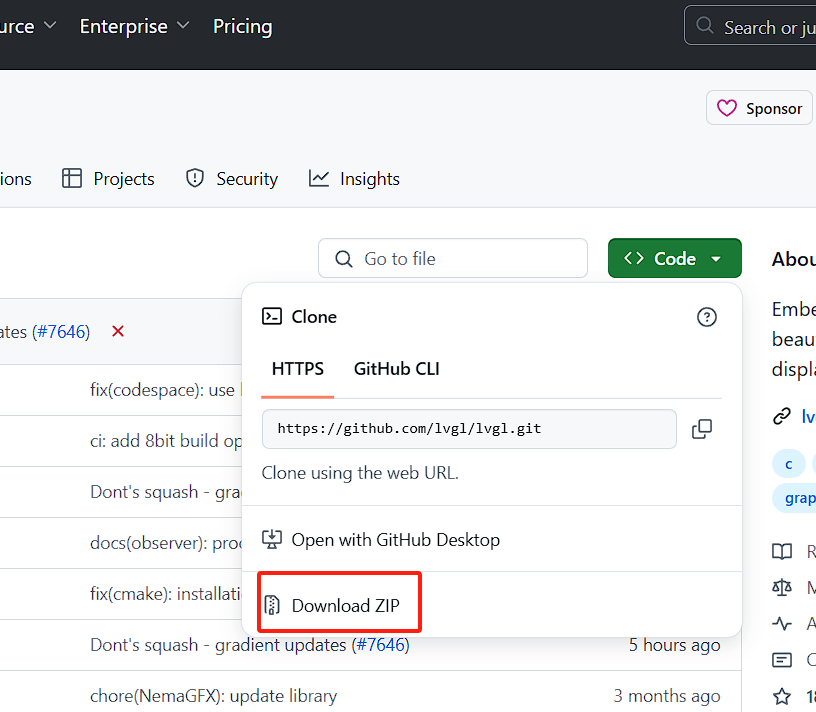

- 定时器中断工程和触控屏实验工程

这两个工程在教程资料里，资料下载链接如下：

https://gitee.com/gaoyanzeng/drg_st_1_lvgl

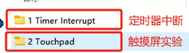

### 3、检查触控屏工程

打开资料文件夹，复制文件夹“2 Touchpad”并重命名为“3 LVGL Porting”。

然后依次打开“3 LVGL Porting”-“Projects”-"MDK-ARM"，把KEIL工程文件重命名为“stm32f407-lvgl”，并删除那两个文件。

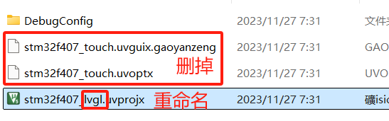

然后打开这个工程，编译并下载，这里应该会有两个warning，不用管。

正确的实验现象：

进行定位，

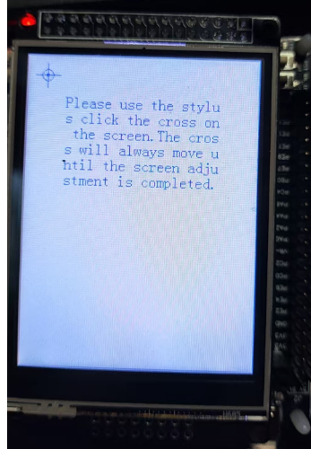

然后就可以涂鸦了

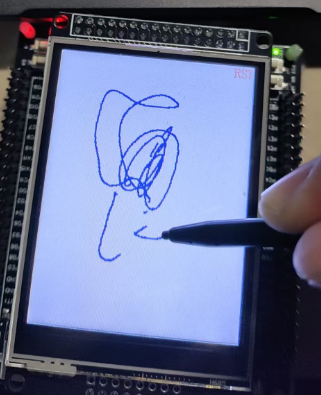   

### 4、添加中断、定时器驱动文件

打开工程"1 Timer Interrupt"-"Drivers"-"BSP"，复制TIMER文件夹，并粘贴到"3 LVGL Porting"的BSP文件夹中。

然后打开KEIL，把TIMER文件夹里的btim.c添加到组"Drivers/BSP"

接着给组"Drivers/STM32F4xx_HAL_Driver"添加文件，如图，找到这个文件夹，点进去选择文件夹Src，

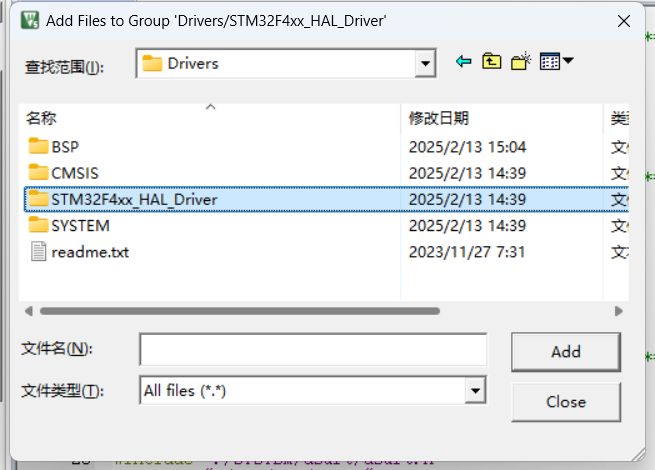

添加这两个文件。

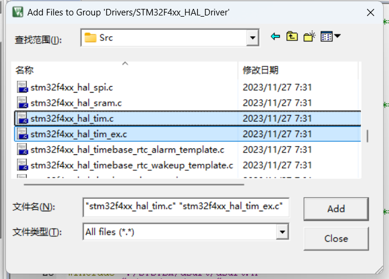

在main.c里增加引用TIMER的头文件，如图：

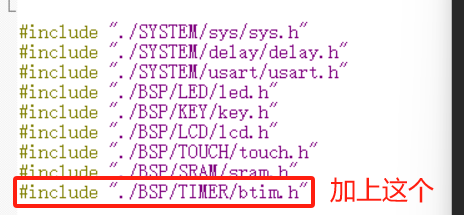

加上定时器中断初始化

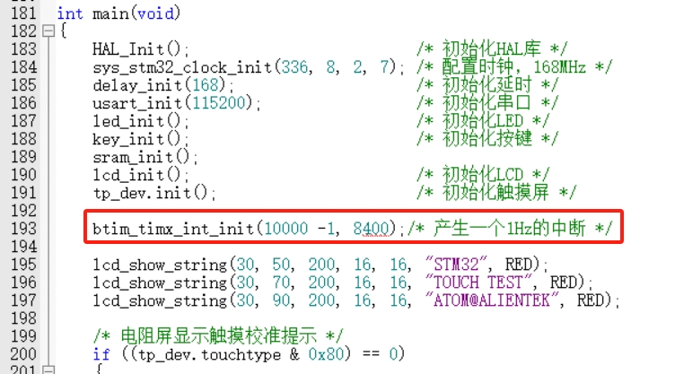

此处定时器中断函数位于btim.c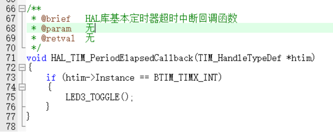

编译下载，正确现象为：开发板上的LED3以1Hz的频率进行闪烁。

---

## 二、代码移植

<mark>基本过程：把LVGL的代码加入到目标工程（上面的工程"3 LVGL Porting"）中。</mark>

### 1、裁剪

- 把之前github上下载的LVGL官方代码文件夹中无用的文件删掉，只保留如下文件，然后把lv_conf_template.h重命名为lv_conf.h。

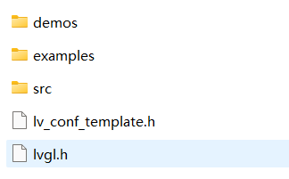

并且examples文件夹中，只保留名为“porting”的文件夹。

- examples文件夹中，disp和indev共四个文件，它们的原名是xxxx_templete，这里把他们名字的_templete删掉。如图：

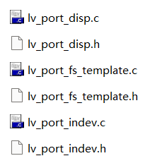

### 2、放置LVGL代码文件

首先把工程的库文件路径深度搞好，在工程文件夹-Middlewares里创建一个文件夹，命名为"LVGL”，然后在这个文件夹里创建两个文件夹，分别叫"APPS""LVGL_SRC"。文件夹父子关系如下图：

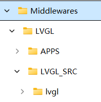

- 放置库函数

把裁剪后的LVGL文件中的这四个文件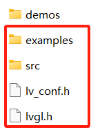复制到路径"工程目录下>Middlewares\LVGL\LVGL_SRC\lvgl“中。

- 放置顶层代码

把裁剪后的LVGL文件中的demos文件夹，复制到"工程目录下>Middlewares\APPS"中。

### 3、在KEIL中添加库函数

点击KEIL的这个选项，添加库函数

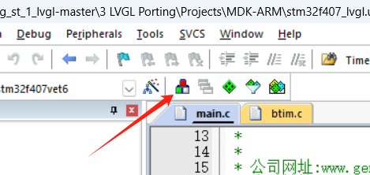

如下图，先添加这几个group，

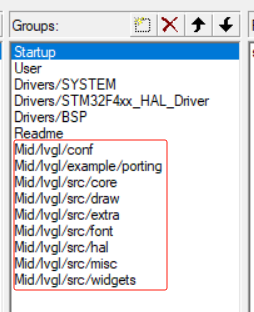

按这个来给每个group添加文件

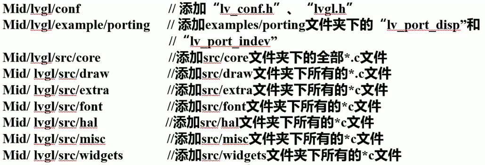

### 4、添加KEIL头文件路径

点击这个，

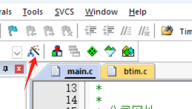

在Target一栏，ARM Complier要选version5

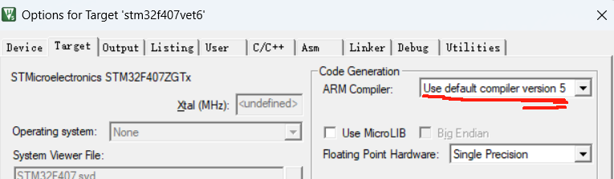

然后在C/C++一栏勾选C99Mode，并添加这几个头文件路径

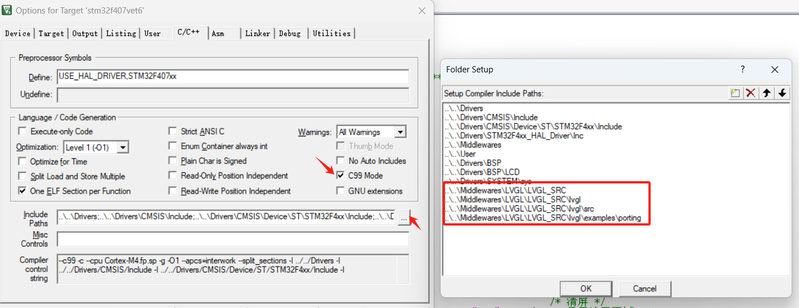

## 三、显示设备配置

### 1、配置输出设备

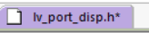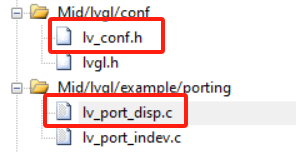

把上图这三个文件中的条件编译指令#if 0改为#if 1，如下图。

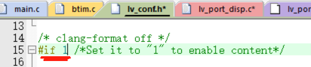

在lv_port_disp.c中进行如下操作

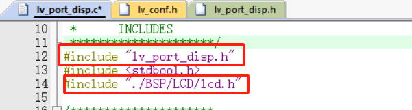

### 2、在disp_init函数中初始化屏幕设备

此函数位于lv_port_disp.c

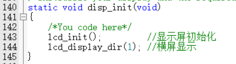

### 3、设置图形数据缓冲模式

LVGL有3中图形缓冲模式，这里不展开解释。把模式2、3的代码直接注释掉，采用第一种缓冲模式。

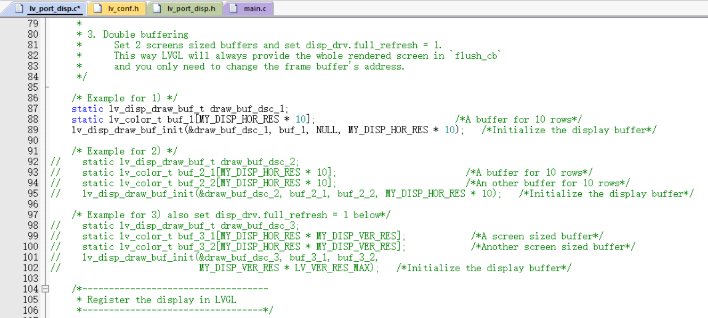

### 4、设置屏幕尺寸

在这里设置屏幕尺寸

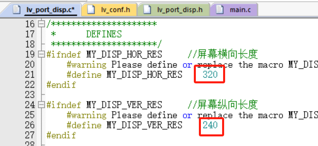

### 5、在disp_flush函数中配置区域描点操作

如图，函数中被注释掉的代码，是LVGL官方的区域描点代码，这里注释掉，采用lcd_color_fill函数进行区域描点操作。

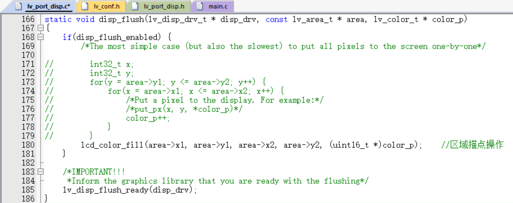

## 四、配置输入设备

### 1、条件编译指令

把lv_port_indev.c/.h两个文件的条件编译指令#if 0改为#if 1。

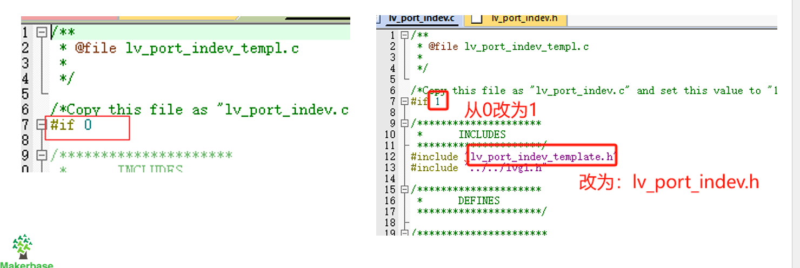

### 2、按需裁剪输入设备

本次移植，只需要触屏输入，在lv_port_indev.c中已有触屏、按键、键盘、鼠标等输入设备，因此把除了触屏以外的代码都注释掉。

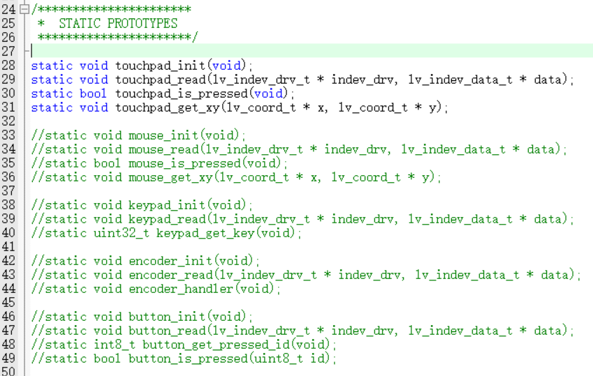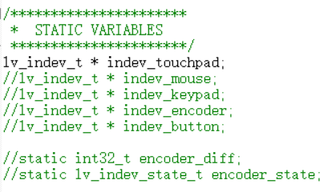

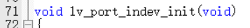

上面这个函数中，只保留touchpad的部分，其余注释掉。

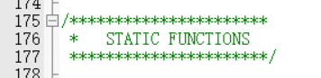

这里这些STATIC函数，也只保留touchpad的部分，其余注释掉。

### 3、包含输入设备驱动头文件

在lv_port_indev.c中包含这个头文件。

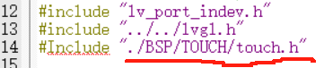

### 4、在touchpad_init函数中初始化触摸屏

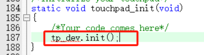

### 5、配置触摸检测函数

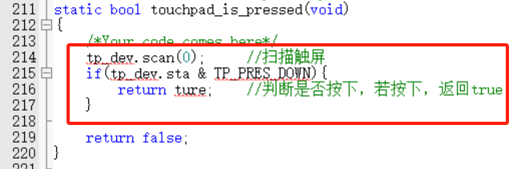

### 6、配置坐标获取函数

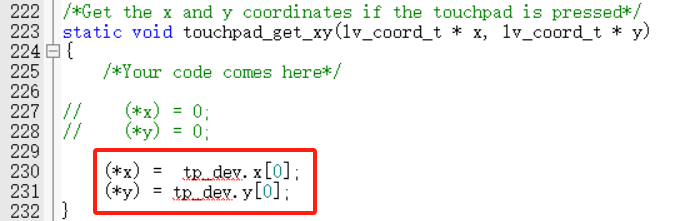

## 五、配置时基

中断服务函数和中断回调函数位于btim.c。

在btim.c中包含头文件lvgl.h，

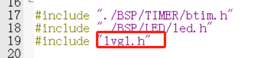

然后在定时器中断回调函数中调用lv_tick_inc函数。

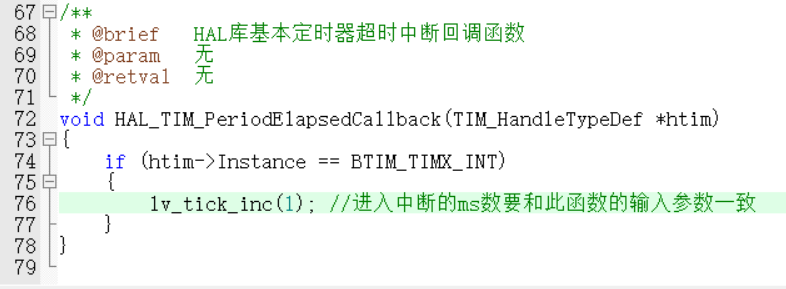

定时器中断频率在main函数中配置

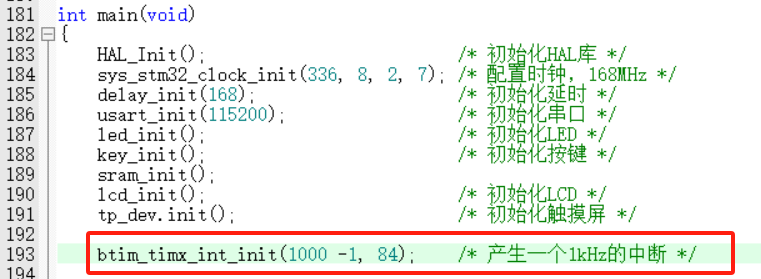

## 五、测试

测试移植效果，尝试在屏幕上显示一个checkbox。

main.c中使用以下代码：

```c
#include "./SYSTEM/sys/sys.h"
#include "./SYSTEM/delay/delay.h"
#include "./SYSTEM/usart/usart.h"
#include "./BSP/LED/led.h"
#include "./BSP/KEY/key.h"
#include "./BSP/LCD/lcd.h"
#include "./BSP/TOUCH/touch.h"
#include "./BSP/SRAM/sram.h"
#include "./BSP/TIMER/btim.h"
#include "lvgl.h"
#include "lv_port_disp.h"
#include "lv_port_indev.h"

int main(void)
{
    HAL_Init();                         /* 初始化HAL库 */
    sys_stm32_clock_init(336, 8, 2, 7); /* 配置时钟，168MHz */
    delay_init(168);                    /* 初始化延时 */
    usart_init(115200);                 /* 初始化串口 */
    led_init();                         /* 初始化LED */
    key_init();                         /* 初始化按键 */
    sram_init();

    btim_timx_int_init(1000 -1, 84);    /* 产生一个1kHz的中断 */

    lv_init();
    lv_port_disp_init();
    lv_port_indev_init();

    lv_obj_t* checkbox_obj = lv_checkbox_create(lv_scr_act());
    lv_obj_set_size(checkbox_obj, 160, 30);
    lv_obj_align(checkbox_obj, LV_ALIGN_CENTER, 0, 0);

    while(1)
    {
        delay_ms(5);
        lv_timer_handler();
    }
}
```

编译下载，成功的话屏幕上是这样的：

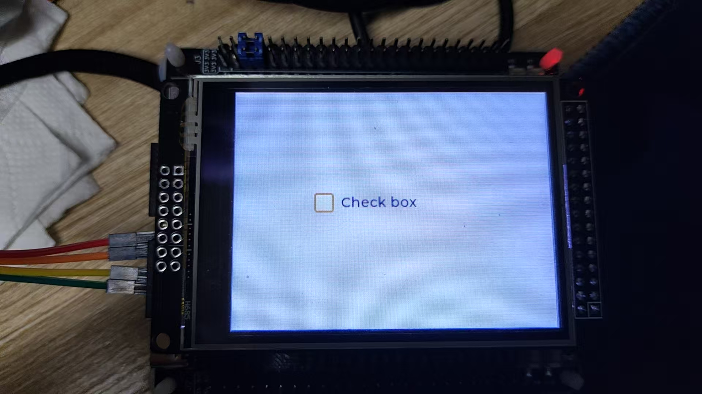

点一下那个框可以勾选，再点一下取消勾选。

---

<mark>移植完成！</mark>