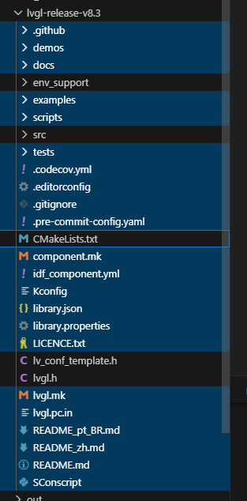
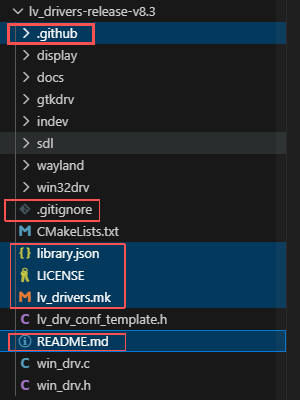

# VScode搭建LVGL模拟器

## 1 准备工具

- mingw：C语言编译工具，github上获取[Releases · niXman/mingw-builds-binaries](https://github.com/niXman/mingw-builds-binaries/releases)，本次使用x86-15.2.0-release-posix-seh-ucrt-rt_v13版本。

- cmake：C语言编译工具，[官网]([Download CMake](https://cmake.org/download/))，本次使用版本cmake-4.2.0-rc4-windows-x86_64。

- lvgl：LVGL的源码，[github链接]([lvgl/lvgl: Embedded graphics library to create beautiful UIs for any MCU, MPU and display type.](https://github.com/lvgl/lvgl))，注意版本tag，本次使用v8.3。

- lvgl_driver：LVGL跨平台支持包，在windows上进行模拟需要这个包，[github链接](https://github.com/lvgl/lv_drivers)（注意版本tag，本次使用v8.3。

- SDL2：C语言的库，用于跨平台gui模拟。[github链接]([Releases · libsdl-org/SDL](https://github.com/libsdl-org/SDL/releases))，下载SDL2-devel-2.32.10-mingw.zip

## 2 安装SDL2库

在github上下载SDL2的zip压缩包，解压后是名为SDL2-2.32.10的文件夹。

mingw解压后名为mingw64。

将SDL2-2.32.10/x86_64-w64-mingw32/下的include和lib文件夹复制到mingw64/x86_64-w64-mingw32/下。

## 3 项目搭建

用EIDE插件创建一个cortex-m内核的空项目（本次取名为lvgl_demo），将STM32工程启动项、标准库或HAL库源文件添加到EIDE项目资源，配置好头文件目录。（技巧：根据已有的STM32工程大致配置好头文件目录和各种必要文件，把报错丢给AI解决）

EIDE这块配置到编译通过，暂时不管EIDE。

按下ctrl+shift+P，选择”CMake：快速入门“，然后跟着VScode的指示填下去即可，几个中共要选项：Ctest、可执行文件、自行选定编译工具并选择gcc。

## 4 添加lvgl源码和跨平台支持包

将lvgl跨平台支持包lv_drivers和lvgl源码lvgl文件夹直接放在lvgl_demo文件夹下。

删掉下面这些无用文件：

然后配置好LVGL的头文件目录

## 5 添加硬件驱动代码

将封装好的屏幕硬件驱动代码文件添加到lvgl_demo中。
