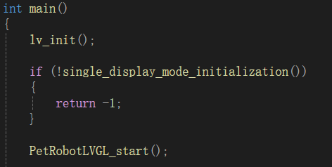

# VisualStudio搭建LVGL模拟器

## 1 安装Visual Studio

1、勾选.NET和C++桌面开发


2、在Visual Studio安装器的“单个组件”栏勾选“MSVC v143......”，如图


然后安装即可。

---

## 2 下载lv_port_pc_visual_studio

网址：

https://github.com/lvgl/lv_port_pc_visual_studio/tree/release/v8.3

版本选择v8.3


先在右上方code选项中下载整个仿真工程的压缩包，然后点进LVGL.Simulator


依次点击这三个文件夹（辅助文件），并下载他们的压缩包。


然后把仿真工程压缩包解压，再把三个辅助文件压缩包解压后，放进对应的路径。如图


---

## 3 测试

打开仿真工程的文件夹，双击运行LVGL.Simulator.sln文件，用VisualStudio2022（我电脑里只有2022版）打开。

然后点击这个.cpp文件


在main函数里有大量的被注释掉的代码，这些是示例，可以选其中一个取消注释，运行一下。

## 4 编写自己的ui界面代码

使用VisualStudio编写ui代码，LVGL的ui实现代码在`lv_port_pc_visual_studio-release-v8.3\LVGL.Simulator\lvgl\demos\`中，官方例程也位于这里。在此创建自己的ui代码的文件夹myapp，里面放自己的ui实现代码myapp.c和myapp.h。

打开VS，在lvgl/demos/中“新建筛选器”（相当于一个文件夹），把myapp.c和myapp.h添加进去，测试代码：

```c
// myapp.h
#ifndef MYAPP_H_
#define MYAPP_H_

#ifdef __cplusplus
 extern "C"{
#endif

#include "lvgl/lvgl.h"

void myapp_start();  //函数声明

#ifdef __cplusplus
}  /*extern "C"*/
#endif

#endif

// myapp.c
#include "myapp.h"

void learn_start()
{
    lv_obj_t* obj = lv_obj_create(lv_scr_act());  //创建窗口对象，
    lv_obj_set_size(obj, LV_PCT(100), LV_PCT(50));  //设置大小
    lv_obj_align(obj, LV_ALIGN_CENTER, 0, 0);  //设置位置

    lv_obj_t* label = lv_label_create(obj);  //创建文本对象
    lv_label_set_text(label, "hello lvgl!");  //添加文本内容
    lv_obj_align(label, LV_ALIGN_CENTER, 0, 0);  //设置位置
}
```

打开LVGL.Simulator.cpp，包含头文件`#include "lvgl/demos/PetRobotLVGL/myapp.h"`，在main函数里调用`myapp_start();`，如图：



ctrl+F5运行即可（注意：注释main函数的所有例程）。

## 5 移植代码到STM32

打开已经移植好LVGL的STM32工程的文件夹，将myapp文件夹粘贴到LVGL源文件中的APP文件夹（比如`STM32工程\LVGL\Middlewares\LVGL\APPS\demos`）里，并在工程里添加源文件、配置头文件目录。

在main.c里include头文件myapp.h，在main.c中调用`myapp_start()`（记得注释掉移植LVGL时的测试代码），编译烧录。
