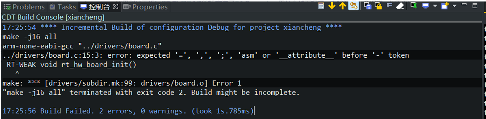
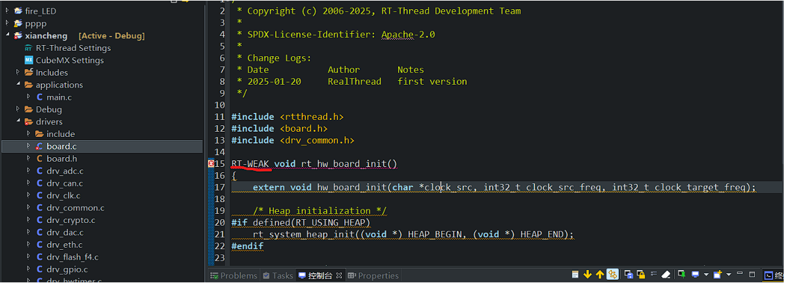

# RT-THREAD 5.1.0工程里board.c有bug

## bug描述：

如果创建工程时RT-THREAD的版本选了5.1.0，main.c里什么都不编辑，直接编译，会报错，如下图：

## 解决方法：

**方法一：**在左侧“项目资源管理器”找到board.c，然后把里面的RT-WEAK改成小写rt-weak。

**方法二：**创建工程的时候别选择5.1.0版本的RT-THREAD，好像4.1.1的比较稳定。