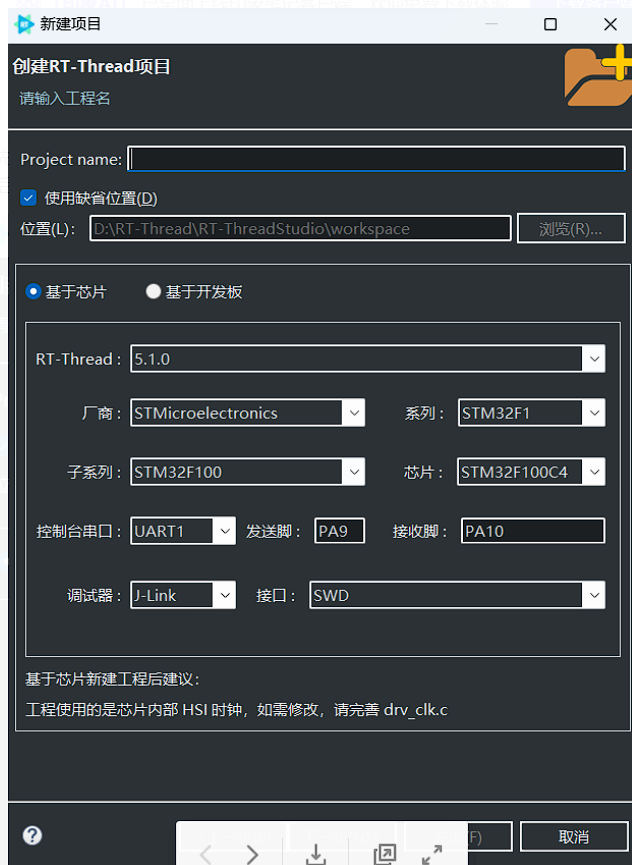
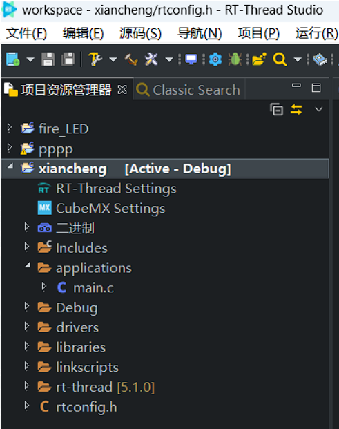
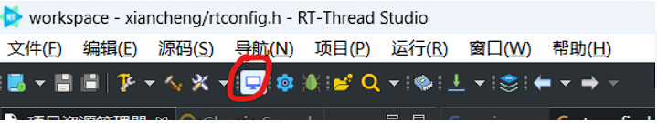
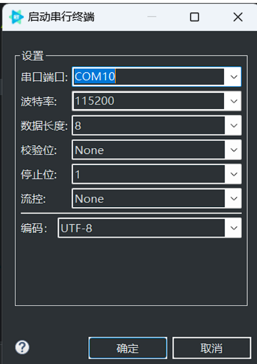

# 线程优先级、时间片（tick）、线程状态

## 一、创建工程

首先进入IDE，最上面选项窗口，依次选择：文件->新建RT-Thread 项目

然后在此窗口中填写工程名、工程地址，选择芯片型号、调试器等。控制台串口可以用来在线调试，可以看到我们发送或者打印的文字。

在左侧“项目资源管理器”中，选择工程目录下的“application”里，可以找到main.c。最底下是rtconfig.h，里面有一些参数。

## 二、终端

点击这个按钮

然后设置串口端口，就可以打开终端了。

