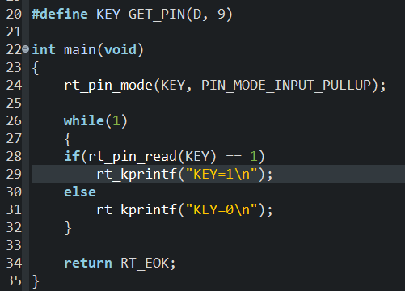
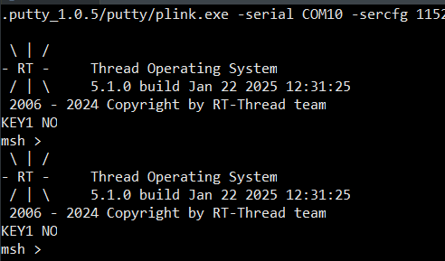

# 流水灯

## 一、知识点

### 1. 三目运算符

常规的ifelse语句是这样的

```c
if (i == 1)
    p += 1;
else
    p += 2;
```

用三目运算符可以简化代码   ?  :

```c
p += i==1?1:2
```

### 2. 简洁的按键消抖代码

以按键的子函数为例。这是视频教程里写的消抖，但我认为作用不大。

```c
unsigned char mode = 0;    //模式变量
void key_entry(void *p)
{
    //这三个变量，用来实现消抖
    //分别表示：①当前按下的按键编号②实际输出的按键③上一刻按键的编号
    unsigned char key_num, key_down, key_old;
    if (rt_pin_read(KEY1) == 1)
        key_num = 1;
    else if (rt_pin_read(KEY2) == 2)
        key_num = 2;
    else 
        key_num = 0;
    key_down = key_num % (key_num^key_old);    //消抖的主要代码
    key_old = key_num;
    switch(key_down)
    {
    case1: mode = 1; break;    //切换模式
    case2: mode = 2; break;
    }
}
```

## 二、踩的坑

### 1. 创建变量的函数使用不当x

这是我创建线程时写的


IDE没有报错，但是有warning

**这段代码有两个错误**

1. 函数rt_thread_create()的第一个参数的类型是const char *name，所以要在名称外面加上双引号

2. 函数rt_thread_create()会返回一个句柄，使用时要把返回的句柄储存在线程结构体中。

正确写法如下：

```c
    LED = rt_thread_create("LED", LED_entry, RT_NULL, 512, 15, 5);
    KEY = rt_thread_create("KEY", KEY_entry, RT_NULL, 512, 16, 5);      //创建线程
```

md我一开始想了半天都每注意到是这两个问题。。。。

### 2. 按键无法控制流水灯

#### 描述：

原本的按键代码是这样的

```c
    if(rt_pin_read(KEY1) == 1)
        key_num = 1;
    else if (rt_pin_read(KEY2) == 1)
        key_num = 2;
    else
        key_num = 0;
    //按键消抖，按键下降沿触发
    key_down = key_num & (key_num^key_old);
    key_old = key_num;
```

上电后流水灯只会按一个方向流动，按键无法操控流水灯。

---

#### 控制变量法

只保留按键部分，发现电平转换都是正常的

接下来单独调试按键线程，发现，好像只运行了一轮就停下来了。

```c
    if(rt_pin_read(KEY1) == 0)
    {
        mode = 1;
        rt_kprintf("KEY1 yes\n");
    }
    else
        rt_kprintf("KEY1 NO\n");
```



如果按住按键再复位，就会发现发送了一个"KEY1 YES"。说明按键没问题。<u>大概率是线程的问题</u>

又看了一遍视频发现，视频中，每个线程函数的工作内容用while(1)循环住了。我的KEY线程没加这个while循环。

加上KEY线程的while循环后按键正常工作了。但是仍然无法操作控制流水灯。

#### 结果

问AI它说LED的优先级要高于KEY才行，修改后可以正常运行了。

#### 新发现

原来的代码，KEY入口函数中的delay函数写在了while循环外面。改到while循环里后，KEY线程优先级大于LED线程也可以正常运行。

##### 原因思考

貌似是关于<u>时间片和线程挂起状态</u>，没太深究原因，但对线程运行的理解更深入了。

---

## 本次工程main.c代码

```c
#include <rtthread.h>

#define DBG_TAG "main"
#define DBG_LVL DBG_LOG
#include <rtdbg.h>

#include <rtdevice.h>
#include <board.h>

#define LED1 GET_PIN(A, 0)
#define LED2 GET_PIN(A, 1)
#define LED3 GET_PIN(A, 2)
#define KEY1 GET_PIN(D, 9)
#define KEY2 GET_PIN(D, 8)      //定义按键和LED引脚

rt_thread_t LED, KEY;   //定义线程
rt_uint8_t mode = 0;    //模式变量

//rt_uint8_t等价于unsigned char
//线程运行函数
void KEY_entry(void *p)
{
    unsigned char k1past = 1, k1now = 1, k2past = 1, k2now = 1;

    while(1)
    {   
        //按键下降沿触发
        k1now = rt_pin_read(KEY1);
        if (k1now < k1past)
            mode = 1;
        k1past = k1now;

        k2now = rt_pin_read(KEY2);
        if (k2now < k2past)
            mode = 2;
        k2past = k2now;

        rt_kprintf("mode=%d\n", mode);

        rt_thread_mdelay(15);
    }
}

//LED线程函数，流水灯
void LED_entry(void *p)
{
    unsigned char i = 0;    //i表示被点亮的LED编号
    while(1)
    {
        rt_pin_write(LED1, i==1?1:0);
        rt_pin_write(LED2, i==2?1:0);
        rt_pin_write(LED3, i==3?1:0);

        if (mode == 1)
            if (++i == 4)
                i = 1;  //模式1，从LED0向LED2流动
        if (mode == 2)
            if (--i == 0 || i == 255)
                i = 3;  //模式2，从LED2向LED0流动
        rt_kprintf("%d", i);
        rt_thread_mdelay(500);
    }
}
int main(void)
{
    //设置IO口模式
    rt_pin_mode(KEY1, PIN_MODE_INPUT_PULLUP);
    rt_pin_mode(KEY2, PIN_MODE_INPUT_PULLUP);
    rt_pin_mode(LED1, PIN_MODE_OUTPUT);
    rt_pin_mode(LED2, PIN_MODE_OUTPUT);
    rt_pin_mode(LED3, PIN_MODE_OUTPUT);

    LED = rt_thread_create("LED", LED_entry, RT_NULL, 512, 15, 5);
    KEY = rt_thread_create("KEY", KEY_entry, RT_NULL, 512, 13, 5);      //创建线程

    if (KEY != RT_NULL)
        rt_thread_startup(KEY);
    else
        rt_kprintf("KEY failed \n");

    if (LED != RT_NULL)
        rt_thread_startup(LED);
    else
        rt_kprintf("LED failed \n");

    return RT_EOK;
}
```