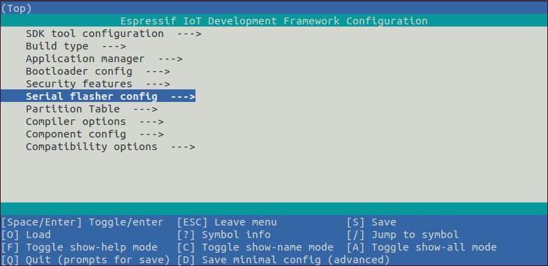

# WSL2搭建ESP32S3开发环境 不安装和使用GUI

## 安装EIM

首先将 EIM 仓库添加到 APT 源列表，以便后续使用 APT 安装 EIM。运行以下：

```shell
echo "deb [trusted=yes] https://dl.espressif.com/dl/eim/apt/ stable main" | sudo tee /etc/apt/sources.list.d/espressif.list

sudo apt update
```

然后APT安装EIM CLI。运行以下：

```shell
sudo apt install eim-cli
```

---

## 使用EIM安装ESP-IDF

（这里只记录使用EIM CLI在线安装的步骤）

运行以下命令：（会自动安装最新稳定版本的ESP-IDF）

```shell
eim install
```

也可以使用以下命令（交互式安装向导）来自定义安装路径、选择IDF版本和其他设置项：

```shell
eim wizard
```

如果安装向导中没有需要的IDF版本，可以运行以下命令来指定版本：

```shell
eim install -i v5.2.2
```

如果终端中出现以下信息，表示安装完成：

```shell
2025-11-03T15:54:12.537993300+08:00 - INFO - Wizard result: %{r}
2025-11-03T15:54:12.544174+08:00 - INFO - Successfully installed IDF
2025-11-03T15:54:12.545913900+08:00 - INFO - Now you can start using IDF tools
```

--- 

## 激活环境

按照以上步骤执行后，运行以下命令来激活ESP-IDF环境：**（把版本换成要使用的）**

```shell
source "/home/wzd/.espressif/tools/activate_idf_v5.2.2.sh"
```

每个新开的终端都要执行上面的命令才能进入ESP-IDF环境，因此可以使用alias来添加别名。

以我设置的alias为例。打开`~/.bashrc`：

```shell
nano ~/.bashrc
```

在最底下添加：

```shell
alias get_idf_522='source "/home/wzd/.espressif/tools/activate_idf_v5.2.2.sh"'
```

之后，可以使用get_idf_522激活ESP-IDF_v5.2.2环境。

---

## 首个项目 hello_world

<mark>**注意：ESP-IDF 编译系统不支持 ESP-IDF 路径或其项目路径中带有空格！！！**</mark>

运行以下命令，将examples/get-started里的hello_world复制到~/esp/，避免污染IDF源码：

```shell
cd ~/esp
cp -r $IDF_PATH/examples/get-started/hello_world .
```

然后依次运行以下命令：

```shell
cd ~/esp/hello_world
idf.py set-target esp32s3
idf.py menuconfig
```

正确操作上述步骤后，系统将显示以下菜单：



可以通过此菜单设置项目的具体变量，包括 Wi-Fi 网络名称、密码和处理器速度等。`hello_world` 示例项目会以默认配置运行，因此在这一项目中，可以跳过使用 `menuconfig` 进行项目配置这一步骤。

在`hello_world`目录下运行以下命令，编译项目：

```shell
idf.py build
```

然后烧录：

```shell
idf.py flash
# 或
idf.py -p PORT flash # 把 PORT 替换成连接ESP32S3开发板的端口名
```

监视项目：

```shell
idf.py -p PORT monitor
```

也可以用`idf.py -p PORT flash monitor`一次性执行构建、烧录、监视过程。

---

## WSL2虚拟机挂载串口设备

以管理员运行powershell，运行以下命令安装 usbipd：

```shell
winget install usbipd
```

打开WSL2终端，安装 usbip 客户端以及硬件数据库：

```shell
sudo apt update
sudo apt install linux-tools-virtual hwdata -y
sudo update-alternatives --install /usr/local/bin/usbip usbip $(command -v ls /usr/lib/linux-tools/*/usbip | tail -n1) 20
```

然后插入USB设备，在PowerShell中运行以下命令列出所有USB设备：

```shell
usbipd list
```

输出中会显示类似以下的内容：

```shell
BUSID  VID:PID    DEVICE                                                        STATE
1-4    10c4:ea60  Silicon Labs CP210x USB to UART Bridge (COM3)                 Not shared
```

记住BUSID。然后绑定设备：

```shell
usbipd bind --busid 1-4
```

挂载设备到 WSL：

```shell
usbipd attach --wsl --busid 1-4
```

在WSL2终端查看USB设备列表：

```shell
lsusb
```

输出一般是这样：

```shell
Bus 001 Device 002: ID 10c4:ea60 Silicon Labs CP210x USB to UART Bridge
```

USB 串口设备在 Linux 中一般会被识别为 /dev/ttyUSB*（如 USB-TTL 模块）或 /dev/ttyACM*。可以通过以下命令查看：

```shell
ls /dev/ttyUSB*
# 或者
ls /dev/ttyACM*
```

烧录示例：

```shell
idf.py -p /dev/ttyACM* flash monitor
```

---

## 内容参考

[在 Linux 上安装 ESP-IDF 及工具链 - ESP32-S3 - — ESP-IDF 编程指南 v6.0.1 文档](https://docs.espressif.com/projects/esp-idf/zh_CN/v6.0.1/esp32s3/get-started/linux-setup.html#)

[在 Linux 或 macOS 上通过命令行构建项目 - ESP32-S3 - — ESP-IDF 编程指南 v6.0.1 文档](https://docs.espressif.com/projects/esp-idf/zh_CN/v6.0.1/esp32s3/get-started/linux-macos-start-project.html)
