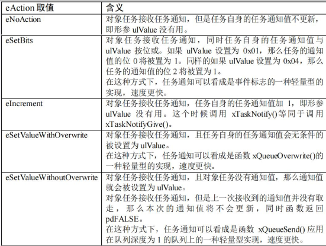
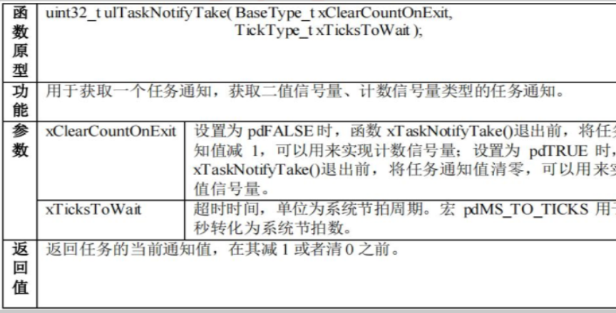
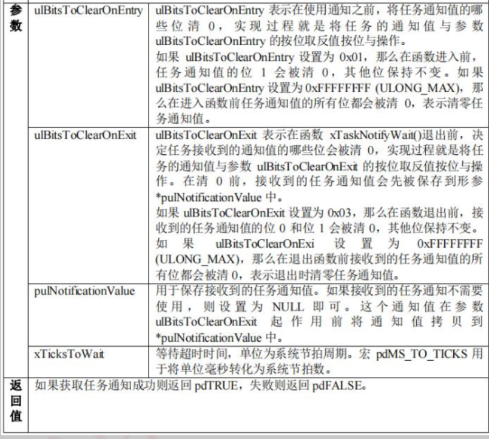

# 10 任务通知

## 10-1 简介

- 每个任务都有一个32位的通知值，在创建任务时会自动初始化任务通知值。

- 在任务或中断中都可以向其他任务发送通知。

- 只有在任务中可以等待通知，中断中不允许等待通知。与其他任务通信方式相似，若通知暂时无效，会根据指定的阻塞超时时间进入阻塞态，直到通知有效，或超过指定的阻塞时间。

- 任务通知值为一个32位的变量，可以通过按位操作再发送，当作轻量事件组，或者当作计数信号量、消息队列等多种用法。

## 10-2 常用API函数

- 要使用任务通知，需要将`FreeRTOSConfig.h`中的宏`configUSE_TASK_NOTIFICATIONS`定义为1.

### 10-2-1 发送通知函数

`xTaskGenericNotify()`：（所有发送函数的基本原型）

- 其他发送函数均以此函数为原型

- 参数1：要发送任务的句柄。

- 参数2：发送的通知值。

- 参数3：更新通知值的方式。如下：



- 参数4：指针变量，接收方任务原先通知值返回。

`xTaskNotifyGive()`：

- 参数仅有原型函数的参数1

- 函数功能：向任务发送通知，将接收方通知值+1，可以作为二值信号量或计数信号量。

- 这种情况下，对方任务等待通知时应用`ulTaskNotifyTake()`而不是`ulTaskNotifyWait()`。

- 中断版本`xTaskNotifyGiveFromISR()`

`xTaskNotify()` :

- 与原型相比，没有参数4。

- 功能：直接向对象任务发送一个32位的通知值，可以实现消息队列的功能。

- 中断版本`xTaskNotifyFromISR()`

`xTaskNotifyAndQuery()`：

- 与`xTaskNotify()`很像，不过多了参数4，用于回传接收方任务的上一个通知值。
- 中断版本`xTaskNotifyFromISR()`。

### 10-2-2 获取通知函数

- 只有任务中可以获取通知，中断中无法获取/等待通知。

`ulTaskNotifyTake()`：

- 专门作为二值信号量和计数信号量的轻量级实现。

- 和`xTaskNotifyGive()`配套使用。

- 有中断版本。

- 有两种模式：一种是在函数退出时，将通知值清零，实现二值信号量；一种是函数退出时将通知值+1，实现计数信号量。

- 

`xTaskNotifyWait()`：

- 全功能版等待任务通知。
- 

## 10-3 示例

```c
#include "system.h"
#include "SysTick.h"
#include "led.h"
#include "usart.h"
#include "FreeRTOS.h"
#include "task.h"
#include "key.h"
#include "string.h"
#include "limits.h"

// 任务优先级
#define START_TASK_PRIO 1
// 任务堆栈大小
#define START_STK_SIZE 128
// 任务句柄
TaskHandle_t StartTask_Handler;
// 任务函数
void start_task(void *pvParameters);

// LED1任务
#define LED1_TASK_PRIO 2
#define LED1_STK_SIZE  50
TaskHandle_t LED1Task_Handler;
void led1_task(void *pvParameters);

// 等待通知任务1
#define Receive1_TASK_PRIO 3
#define Receive1_STK_SIZE  512
TaskHandle_t Receive1Task_Handler;
void Receive1_task(void *pvParameters);

// 等待通知任务2
#define Receive2_TASK_PRIO 4
#define Receive2_STK_SIZE  512
TaskHandle_t Receive2Task_Handler;
void Receive2_task(void *pvParameters);

// 发送通知任务
#define Send_TASK_PRIO 5
#define Send_STK_SIZE  512
TaskHandle_t SendTask_Handler;
void Send_task(void *pvParameters);

// 测试任务通知实现其他通信方式
// 1为消息队列，2为二值信号量，3为计数信号量，4为事件组
#define TEST_MODE 4

// 消息队列消息
#define QUEUE_DATA1 "queue data 111"
#define QUEUE_DATA2 "queue data 222"

// 事件组标志位
#define EVENT111 (0x01 << 0)
#define EVENT222 (0x01 << 1)

int main()
{
    SysTick_Init(72);
    NVIC_PriorityGroupConfig(NVIC_PriorityGroup_4); // 设置系统中断优先级分组4
    LED_Init();
    USART1_Init(115200);
    printf("Program Notify starting!\n");

    // 创建开始任务
    xTaskCreate((TaskFunction_t)start_task,          // 任务函数
                (const char *)"start_task",          // 任务名称
                (uint16_t)START_STK_SIZE,            // 任务堆栈大小
                (void *)NULL,                        // 传递给任务函数的参数
                (UBaseType_t)START_TASK_PRIO,        // 任务优先级
                (TaskHandle_t *)&StartTask_Handler); // 任务句柄
    vTaskStartScheduler();                           // 开启任务调度
}

// 开始任务任务函数
void start_task(void *pvParameters)
{
    taskENTER_CRITICAL(); // 进入临界区

    // 创建LED1任务
    xTaskCreate((TaskFunction_t)led1_task,
                (const char *)"led1_task",
                (uint16_t)LED1_STK_SIZE,
                (void *)NULL,
                (UBaseType_t)LED1_TASK_PRIO,
                (TaskHandle_t *)&LED1Task_Handler);

    xTaskCreate((TaskFunction_t)Receive1_task,
                (const char *)"Receive1_task",
                (uint16_t)Receive1_STK_SIZE,
                (void *)NULL,
                (UBaseType_t)Receive1_TASK_PRIO,
                (TaskHandle_t *)&Receive1Task_Handler);

    xTaskCreate((TaskFunction_t)Receive2_task,
                (const char *)"Receive2_task",
                (uint16_t)Receive2_STK_SIZE,
                (void *)NULL,
                (UBaseType_t)Receive2_TASK_PRIO,
                (TaskHandle_t *)&Receive2Task_Handler);

    xTaskCreate((TaskFunction_t)Send_task,
                (const char *)"Send_task",
                (uint16_t)Send_STK_SIZE,
                (void *)NULL,
                (UBaseType_t)Send_TASK_PRIO,
                (TaskHandle_t *)&SendTask_Handler);

    vTaskDelete(StartTask_Handler); // 删除开始任务
    taskEXIT_CRITICAL();            // 退出临界区
}

// LED1任务函数
void led1_task(void *pvParameters)
{
    while (1) {
        LED_Ctrl(1, LIGHT_ON);
        LED_Ctrl(2, LIGHT_ON);
        vTaskDelay(800);
        LED_Ctrl(1, LIGHT_OFF);
        LED_Ctrl(2, LIGHT_OFF);
        vTaskDelay(200);
    }
}

// 等待通知任务1函数
void Receive1_task(void *pvParameters)
{
    BaseType_t xReturn = pdPASS;

#if TEST_MODE == 1
    char *queue_data1;
#endif

    while (1) {
#if TEST_MODE == 1
        xReturn = xTaskNotifyWait(0x00000000,               /*通知前清除哪些通知位，不清除*/
                                  0xffffffff,               /*退出前清除哪些位，全部清除*/
                                  (uint32_t *)&queue_data1, /*接收数据存放处*/
                                  portMAX_DELAY);           // 阻塞时间
        if (xReturn == pdPASS) {
            printf("RcvTask222 receive:%s\n", queue_data1);
        }
#endif
#if TEST_MODE == 2
        ulTaskNotifyTake(pdTRUE,         /* 退出获取函数时清空通知值，模拟二值信号量*/
                         portMAX_DELAY); // 超时等待时间
        printf("RcvTask111: BinarySema received\n");
#endif
        vTaskDelay(pdMS_TO_TICKS(10));
    }
}

// 等待通知任务2函数
void Receive2_task(void *pvParameters)
{
    BaseType_t xReturn = NULL;

#if TEST_MODE == 1
    char *queue_data2;
#endif

#if TEST_MODE == 3
    uint32_t cnt_num;
#endif
#if TEST_MODE == 4
    uint32_t rcv_event  = 0; // 事件接收变量
    uint32_t last_event = 0; // 保存事件的变量
#endif

    while (1) {
#if TEST_MODE == 1
        xReturn = xTaskNotifyWait(0x00000000,               /*通知前清除哪些通知位，不清除*/
                                  0xffffffff,               /*退出前清除哪些位，全部清除*/
                                  (uint32_t *)&queue_data2, /*接收数据存放处*/
                                  portMAX_DELAY);           // 阻塞时间
        if (xReturn == pdPASS) {
            printf("RcvTask222 receive:%s\n", queue_data2);
        }
#endif
#if TEST_MODE == 2
        ulTaskNotifyTake(pdTRUE, portMAX_DELAY);
        printf("RcvTask222: BinarySema received\n");
#endif
#if TEST_MODE == 3
        if (USART1_RX_BUF[0] == 'b') {
            cnt_num = ulTaskNotifyTake(pdFALSE, 0); // 退出时不清空通知值，没获取到不等待
            if (cnt_num > 0) {
                printf("RcvTask222: CntSema num=%d\n", cnt_num);
            } else {
                printf("RcvTask222: CntSema empty\n");
            }
        }
#endif
#if TEST_MODE == 4
        printf("RcvTask111: Waiting\n");
        xReturn = xTaskNotifyWait(0x00,           /* 进入函数时通知值所有位都不清零 */
                                  ULONG_MAX,      /* 退出函数时通知值所有位都清零 */
                                  &rcv_event,     /* 保存接收到的值 */
                                  portMAX_DELAY); // 超时等待时间
        if (xReturn == pdTRUE) {
            last_event |= rcv_event;
            if (last_event == (EVENT111 | EVENT222)) {
                last_event = 0; // 事件激活，直接归零事件值
                printf("RcvTask111: Event111 and Event222 recved\n");
            } else if (last_event == EVENT111) {
                last_event = 0;
                printf("RcvTask222: Event111 recved\n");
            } else if (last_event == EVENT222) {
                last_event = 0;
                printf("RcvTask222: Event222 recved\n");
            }
        }
#endif
        vTaskDelay(pdMS_TO_TICKS(10));
    }
}

// 发送通知任务函数
void Send_task(void *pvParameters)
{
    BaseType_t xReturn = pdPASS;

#if TEST_MODE == 1
    char queue_data1[] = "queue data 111";
    char queue_data2[] = "queue data 222";
#endif

    while (1) {
        if ((USART1_RX_STA & 0x8000) != 0) { /* 接收完成 */
            printf("Command:%s\n", USART1_RX_BUF);

            /* 指令判断 */
#if TEST_MODE == 1                                             // 模拟消息队列
            if (USART1_RX_BUF[0] == 'a') {                     // 指令1
                xReturn = xTaskNotify(Receive1Task_Handler,    /*任务句柄*/
                                      (uint32_t)&queue_data1,  /*发送数据，最大4字节*/
                                      eSetValueWithOverwrite); /*通知值更新方式, 覆盖当前通知*/
                if (xReturn == pdPASS) {
                    printf("Successfully send Queue data111\n");
                }
            }
            if (USART1_RX_BUF[1] == 'b') {                     /* 指令2 */
                xReturn = xTaskNotify(Receive2Task_Handler,    /*任务句柄*/
                                      (uint32_t)&queue_data2,  /*发送数据，最大4字节*/
                                      eSetValueWithOverwrite); /*通知值更新方式, 覆盖当前通知*/
                if (xReturn == pdPASS) {
                    printf("Successfully send Queue data222\n");
                }
            }
#endif
#if TEST_MODE == 2                                               // 模拟二值信号量
            if (USART1_RX_BUF[0] == 'a') {                       // 指令1
                xReturn = xTaskNotifyGive(Receive1Task_Handler); // 参数：对象任务句柄
                if (xReturn == pdPASS) {
                    printf("Successfully send BinarySemaphore data111\n");
                }
            }
            if (USART1_RX_BUF[1] == 'b') { /* 指令2 */
                xReturn = xTaskNotifyGive(Receive2Task_Handler);
                if (xReturn == pdPASS) {
                    printf("Successfully send BinarySemaphore data222\n");
                }
            }
#endif
#if TEST_MODE == 3 // 模拟计数信号量
            if (USART1_RX_BUF[0] == 'a') {
                xReturn = xTaskNotifyGive(Receive2Task_Handler);
                if (xReturn == pdTRUE) {
                    printf("SndTask: CntSema gived\n");
                }
            }
#endif
#if TEST_MODE == 4                                          // 模拟事件组
            if (USART1_RX_BUF[0] == 'a') {                  /* 事件1 */
                xReturn = xTaskNotify(Receive2Task_Handler, /* 对象任务句柄 */
                                      EVENT111,             /* 要发送的内容 */
                                      eSetBits);            // 对象任务通知值与参数2 ulValue按位或
                if (xReturn == pdTRUE) {
                    printf("SendTask: Event111 occured\n");
                }
            }
            if (USART1_RX_BUF[1] == 'b') {                  /* 事件2 */
                xReturn = xTaskNotify(Receive2Task_Handler, /* 对象任务句柄 */
                                      EVENT222,             /* 要发送的内容 */
                                      eSetBits);            // 对象任务通知值与参数2 ulValue按位或
                if (xReturn == pdTRUE) {
                    printf("SendTask: Event222 occured\n");
                }
            }
#endif
            /* END */

            // 清空串口接收状态
            USART1_RX_STA = 0;
            memset(USART1_RX_BUF, 0, sizeof(USART1_RX_BUF));
        }
        vTaskDelay(pdMS_TO_TICKS(10));
    }
}
```
