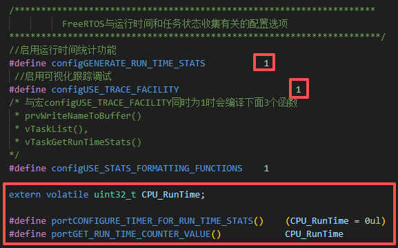
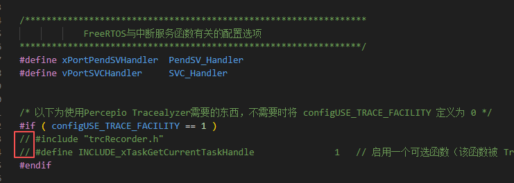

# 13 CPU利用率

## 13-1 简介

### 13-1-1 CPU利用率统计原理

统计利用率的方式是，在一段时间里程序运行的情况。比如100ms中，A任务总共占用50ms，B任务总共占用20ms，中断任务占用10ms，空闲20ms，那么这100ms中CPU利用率就是80%。

### 13-1-2 FreeRTOS统计CPU利用率

要使用CPU利用率统计，需要先在FreeRTOSConfig.h中配置与系统运行时间和任务状态收集相关的配置，并且实现两个宏函数：`portCONFIGURE_TIMER_FOR_RUN_TIME_STATS() `和`portGET_RUN_TIME_COUNTER_VALUE()`，如下图：





然后需要实现一个10000Hz的定时器，将CPU_RunTIme自加，用于系统运行时间统计。

学习时用的是C8T6的基本定时器TM2。

## 13-2 API函数

### 13-2-1 查询任务信息

`void vTaskList(char * pcWriteBuffer)`：

- 参数：获取到的信息保存地址（字符串首地址）。

- 使用时会先创建一个列表，包含任务名称，任务状态信息，任务优先级，剩余堆栈以及任务编号的信息

### 13-2-2 统计任务占用CPU时间

`void vTaskGetRunTimeStats(char *pcWriteBuffer)`：

- 参数：获取到的信息保存地址（字符串首地址）。
- 此函数统计各个Task占用CPU时长和百分比、CPU整体利用率。
- 获取CPU占用率时，会出现一个”IDLE“任务，这是一个空闲任务，在没有任何任务处于就绪态，IDLE就运行了，IDLE相当于程序空闲的占比。

## 13-3 示例

```c
#include "system.h"
#include "SysTick.h"
#include "led.h"
#include "usart.h"
#include "FreeRTOS.h"
#include "task.h"
#include "key.h"
#include "timer.h"
#include "string.h"

//任务优先级
#define START_TASK_PRIO        1
//任务堆栈大小    
#define START_STK_SIZE         128  
//任务句柄
TaskHandle_t StartTask_Handler;
//任务函数
void start_task(void *pvParameters);

// LED1任务
#define LED1_TASK_PRIO        2
#define LED1_STK_SIZE         50  
TaskHandle_t LED1Task_Handler;
void led1_task(void *pvParameters);

// CPU统计任务
#define CPU_TASK_PRIO       3
#define CPU_STK_SIZE        512
TaskHandle_t CPU_Task_Handler;
void CPU_task(void *pvParameters);

int main()
{
    SysTick_Init(72);
    NVIC_PriorityGroupConfig(NVIC_PriorityGroup_4);//设置系统中断优先级分组4
    LED_Init();
    USART1_Init(115200);
    printf("main:Program starting!\n");
    TIM2_Init(100-1, 72-1);     // 定时0.1ms

    //创建开始任务
    xTaskCreate((TaskFunction_t )start_task,            //任务函数
                (const char*    )"start_task",          //任务名称
                (uint16_t       )START_STK_SIZE,        //任务堆栈大小
                (void*          )NULL,                  //传递给任务函数的参数
                (UBaseType_t    )START_TASK_PRIO,       //任务优先级
                (TaskHandle_t*  )&StartTask_Handler);   //任务句柄              
    vTaskStartScheduler();          //开启任务调度
}

//开始任务任务函数
void start_task(void *pvParameters)
{
    taskENTER_CRITICAL();           //进入临界区

    //创建LED1任务
    xTaskCreate((TaskFunction_t )led1_task,     
                (const char*    )"led1_task",   
                (uint16_t       )LED1_STK_SIZE, 
                (void*          )NULL,
                (UBaseType_t    )LED1_TASK_PRIO,
                (TaskHandle_t*  )&LED1Task_Handler); 

    //创建CPU统计任务
    xTaskCreate((TaskFunction_t )CPU_task,     
                (const char*    )"CPU_task",   
                (uint16_t       )CPU_STK_SIZE, 
                (void*          )NULL,
                (UBaseType_t    )CPU_TASK_PRIO,
                (TaskHandle_t*  )&CPU_Task_Handler); 

    vTaskDelete(StartTask_Handler); //删除开始任务
    taskEXIT_CRITICAL();            //退出临界区
} 

//LED1任务函数
void led1_task(void *pvParameters)
{
    while(1)
    {
        printf("led1_task: led1 and led2 ON\n");
        LED_Ctrl(1, LIGHT_ON);
        LED_Ctrl(2, LIGHT_ON);
        vTaskDelay(500);

        printf("led1_task: led1 and led2 OFF\n");
        LED_Ctrl(1, LIGHT_OFF);
        LED_Ctrl(2, LIGHT_OFF);
        vTaskDelay(500);
    }
}

// CPU统计任务
void CPU_task(void *pvParameters)
{
    uint8_t CPU_RunInfo[400];   // 保存任务信息

    while(1)
    {
        memset(CPU_RunInfo, 0, 400);
        vTaskList((char*)&CPU_RunInfo);

        printf("---------------------------------------------\n");
        printf("Task      Task_State  PRIO  left_tack  Task_Num\n");
        printf("%s", CPU_RunInfo);
        printf("---------------------------------------------\n");

        memset(CPU_RunInfo, 0, 400);
        vTaskGetRunTimeStats((char*)&CPU_RunInfo);

        printf("Task      Run_Count    Utilization_Rate\n");
        printf("%s\n", CPU_RunInfo);
        printf("---------------------------------------------\n");

        vTaskDelay(5000);
    }
}
```