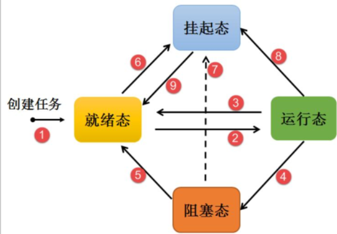

# 4 任务管理

## 4-1 任务状态

任务有四种状态：

- 就绪态(ready)：任务就绪，随时可运行。新创建的任务会处于就绪态。

- 运行态(running)：任务正在运行。

- 阻塞态(blocked)：任务在等待时序、等待外部中断等的时候，处于阻塞态。

- 挂起态(suspended)：任务只有通过调用函数`vTaskSuspend()`函数才能进入挂起态，此时对于调度器而言是不可见的。



## 4-2 常用API函数

### 4-2-1 任务挂起函数

- `void vTaskSuspend(TaskHandle_t xTaskTosupend)`：将任务挂起，参数为任务句柄，若为NULL，即删除自己。

- `void vTaskSuspendAll(void)`：挂起所有任务，相当于锁定调度器。

### 4-2-2 任务恢复函数

- `void vTaskResume(TaskHandle_t xTaskToResume)`：将任务从挂起态恢复。参数为任务句柄。

- `void vTaskResumeAll(void)`：将所有任务从挂起态恢复。

- `BaskType_t vTaskResumeFromISR(TaskHandle_t xTaskToResume)`：与`vTaskResume()`类似，不过此函数专门用在中断服务程序中。参数为要恢复的任务句柄。返回值为pdTRUE时，即被恢复的任务优先级高于正在运行的任务，则退出中断服务函数时必须进行一次上下文切换。若为pdFALSE，则反之，不需要进行上下文切换。

### 4-2-3 任务删除函数

- `void vTaskDelete(TaskHandle_t xTaskToDelete)`：参数为任务句柄，若为NULL，即删除自己。

### 4-2-4 任务延时函数

- `vTaskDelay(const TickType_t xTicksToDelay)`：相对延时。参数为延时节拍数。任务延时时，会进入阻塞态，以便于更低优先级的任务有机会运行。相对延时的缺点：精度不高，有更高优先级的中断、任务时，延时精度降低。

- `vTaskDelayUntil(TickType_t * pxPreviousWakeTime, const TickType_t xTimeIncrement)`：绝对延时函数。延时精度较高。参数1：任务最后一次接触阻塞的时刻，第一次使用时初始化为当前时间。参数2：周期循环时间。

## 4-3 任务设计要点

FreeRtos中程序运行的上下文包括：

- 中断服务函数：尽量简短。

- 普通任务：

- 空闲任务：

- 任务执行时间：根据任务执行时间分配优先级。一般执行时间较短的任务要分配较高优先级，避免长耗时任务影响短耗时任务的执行。

## 4-4 使用示例

```c
#include "system.h"
#include "SysTick.h"
#include "FreeRTOS.h"
#include "task.h"
#include "led.h"
#include "usart.h"
#include "key.h"

//任务优先级
#define START_TASK_PRIO        1
//任务堆栈大小    
#define START_STK_SIZE         128  
//任务句柄
TaskHandle_t StartTask_Handler;
//任务函数
void start_task(void *pvParameters);

//任务优先级
#define LED1_TASK_PRIO        2
//任务堆栈大小    
#define LED1_STK_SIZE         50  
//任务句柄
TaskHandle_t LED1Task_Handler;
//任务函数
void led1_task(void *pvParameters);

//任务优先级
#define LED2_TASK_PRIO        2
//任务堆栈大小    
#define LED2_STK_SIZE         50  
//任务句柄
TaskHandle_t LED2Task_Handler;
//任务函数
void led2_task(void *pvParameters);

// 任务优先级
#define KEY_TASK_PRIO       4
// 任务堆栈大小
#define KEY_STK_SIZE      50
// 任务句柄
TaskHandle_t keyTask_Handler;
// 任务函数
void key_task(void *pvParameters);

/*******************************************************************************
* 函 数 名         : main
* 函数功能           : 主函数
* 输    入         : 无
* 输    出         : 无
*******************************************************************************/
int main()
{
    SysTick_Init(72);
    NVIC_PriorityGroupConfig(NVIC_PriorityGroup_4);//设置系统中断优先级分组4
    LED_Init();
    KEY_Init();
    USART1_Init(115200);

    //创建开始任务
    xTaskCreate((TaskFunction_t )start_task,            //任务函数
                (const char*    )"start_task",          //任务名称
                (uint16_t       )START_STK_SIZE,        //任务堆栈大小
                (void*          )NULL,                  //传递给任务函数的参数
                (UBaseType_t    )START_TASK_PRIO,       //任务优先级
                (TaskHandle_t*  )&StartTask_Handler);   //任务句柄              
    vTaskStartScheduler();          //开启任务调度
}

//开始任务任务函数
void start_task(void *pvParameters)
{
    taskENTER_CRITICAL();           //进入临界区

    printf("Start creating tasks!\n");

    //创建LED1任务
    xTaskCreate((TaskFunction_t )led1_task,     
                (const char*    )"led1_task",   
                (uint16_t       )LED1_STK_SIZE, 
                (void*          )NULL,
                (UBaseType_t    )LED1_TASK_PRIO,
                (TaskHandle_t*  )&LED1Task_Handler);
    // 创建LED2任务
    xTaskCreate((TaskFunction_t )led2_task,
                (const char*    )"led2_task",
                (uint16_t       )LED2_STK_SIZE,
                (void*          )NULL,
                (UBaseType_t    )LED2_TASK_PRIO,
                (TaskHandle_t*  )&LED2Task_Handler); 
    // 创建LED2任务
    xTaskCreate((TaskFunction_t )key_task,
                (const char*    )"key_task",
                (uint16_t       )KEY_STK_SIZE,
                (void*          )NULL,
                (UBaseType_t    )KEY_TASK_PRIO,
                (TaskHandle_t*  )&keyTask_Handler);

    printf("Creating tasks accessfully!\n");

    vTaskDelete(StartTask_Handler); //删除开始任务
    taskEXIT_CRITICAL();            //退出临界区
} 

//LED1任务函数
void led1_task(void *pvParameters)
{
    while(1)
    {
        LED1 = 0;
        vTaskDelay(200);
        LED1=1;
        vTaskDelay(800);
    }
}

// LED2函数
void led2_task(void *pvParameters)
{
    while(1)
    {
        LED2=0;
        vTaskDelay(200);
        LED2=1;
        vTaskDelay(800);
    }
}

// key函数
void key_task(void *pvParameters)
{
    uint8_t key = 0;
    while(1)
    {
        key = KEY_Scan();
        if (key == KEY0_PRESS)
        {
            printf("Suspend task led2!\n");
            vTaskSuspend(LED2Task_Handler);
            printf("Accessfully suspend task led2!\n");
        }
        else if (key == KEY1_PRESS)
        {
            printf("Resume task led2!\n");
            vTaskResume(LED2Task_Handler);
            printf("Accessfully resume task led2\n");
        }
        vTaskDelay(20);
    }

}
```