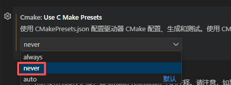
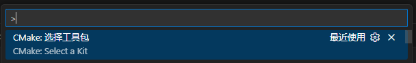
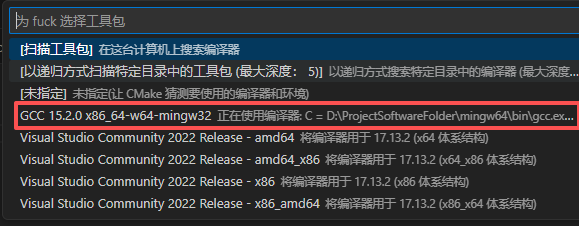
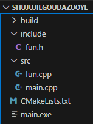
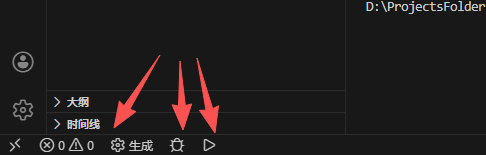
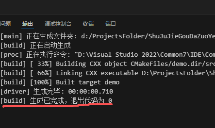

这个方法比较简单，不使用CMakePresets.json，项目只由build、cmakelists、源文件头文件组成。

# 1 准备工作

安装VScode（略）

安装GCC和mingw（上网找教程，很简单）

安装插件：

- C/C++

- CMake

- CMake Tools

# 2 搭建项目

新建一个文件夹用于存放项目。

注意：文件夹名和文件夹路径不要出现中文。

在VScode中选择“打开文件夹”

---

## 2-1 创建main.cpp

（个人习惯）在项目路径下创建文件夹：src（存放源文件 .cpp）、include（存放头文件 .h）。

在src中创建main.cpp，随便写一点：

```cpp
#include <iostream>

int main(int, char**){
    std::cout << "hello world" << std::endl;

    return 0;
}
```

---

## 2-2 创建CMakeLists.txt

在项目路径中创建CmakeLists.txt，对照模板（看注释）进行编写：

```cpp
cmake_minimum_required(VERSION 3.10.0)    # 版本不用修改

# 项目信息，不用修改
# 第一个参数是项目名，下面的代码出现demo就表示项目名。
project(demo VERSION 0.1.0 LANGUAGES C CXX)    

# 设置exe输出路径
# 第二个参数是路径，可以改成别的
# 比如想让exe生成到bin文件夹，可以改成"${PROJECT_SOURCE_DIR}/bin"
set(EXECUTABLE_OUTPUT_PATH "${PROJECT_SOURCE_DIR}")

# 自动扫描并编译src文件夹下的所有文件
file(GLOB SRC_LIST "${PROJECT_SOURCE_DIR}/*.cpp")
add_executable(demo ${SRC_LIST})

# 设置exe的名字
set_target_properties(demo PROPERTIES OUTPUT_NAME "main")

# 头文件搜索路径
target_include_directories(demo PRIVATE include)
```

---

## 2-3 选择工具包

进入VScode的设置，搜索"Cmake:Use C Make Presets"，调成never。



回到，main.cpp，按下crtl+shift+P，选择“CMAKE：选择工具包”，



然后选择自己安装的gcc



然后VScode会生成build文件，同时按照cmakelists文件在项目路径中生成main.exe。

项目结构应该是这样的（以我的项目举例）：



---

# 3 使用方法

生成、调试、运行按键：



点击VScode底部栏的build生成按键，如果像下面这样，说明没问题了。

点击三角形的运行按键，程序会在VScode的终端中运行。虫子按钮是调试，自行探索。
