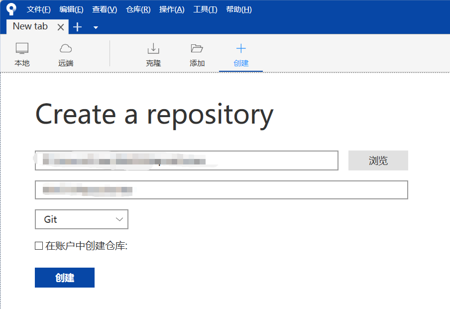

# 本地git仓库（Sourcetree）

<u>Sourcetree可以链接github等远程/云端仓库，这里只用本地的功能。</u>

## 1 安装

安装链接：https://www.sourcetreeapp.com/download-archives

下载.exe安装包，安装即可。

## 2 创建仓库

第一个填路径，第二个填名字。

## 3 一些设置

在 上方栏 - 工具 - 选项 - Repo Setting 中可以修改项目路径，这个路径用来保存克隆的项目，避免直接安装到C盘。
