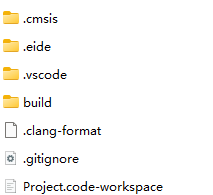
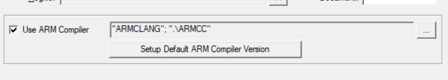

# 用VScode开发单片机

只需要给VScode下几个插件就可以实现，目前使用下来没问题。下面是步骤

## 一、下载插件

在VScode里安装这几个插件

## 二、设置插件

安装好Embedded IDE插件后，VScode左侧应该会有这个图标，这个图标名称是EIDE，就是Embedded IDE的缩写

点开后是这样的

点击设置工具链，

这两个就是C51和MDK，先点击其中一个，弹出文件选择窗口。找到KEIL安装路径，下面会有一个TOOLS.INI，选择它

这样就设置好工具链了。然后就是导入工程的事情

## 三、如何导入、打开、管理头文件

### 1、导入项目

打开EIDE的窗口，在下面有个OPERATIONS

点击导入项目，然后VScode上方会让你选择MDK或者其他之类的东西。

用MDK举例，点击MDK后，找到你要打开的KEIL工程的.uvproj文件，比如这个

然后VScode会提示你下面这个东西。要注意：EIDE项目路径就是VScode的工作区目录。所以如果要在VScode里用agent，最好直接选yes。

EIDE项目中包含如下文件：

这时，EIDE界面就有你的工程了

### 2、打开项目

点击EIDE界面的打开项目，然后选择你要打开的项目的.code-workspace文件。类似下面这种。

注意：已经导入过VScode的工程，VScode会自动在此工程路径下生成一些文件，这时，才能通过“打开项目”来打开此项目

### 3、管理头文件

如图。在EIDE界面中，点击包含目录的加号，并选择文件夹，就可以添加头文件了

## 四、经验总结

### 1、 .HEX文件

用EIDE插件打开并编译KEIL工程后，生成的HEX文件跟KEIL生成的路径不同，在VScode的终端可以看到具体路径

### 2、报错Please select first the target STM32F10x device used in your application (in stm32f10x.h file)

在EIDE Project - C/C++属性 - 预处理宏定义 下添加一个STM32F10X_HD

### 3、使用STLink烧录时找不到hex文件

点击构建配置 - 构建器选项 - 铅笔，在链接器中把”不生成HEX文件“关闭，点击保存即可。

### 4、串口发送数据乱码/接收数据识别不了

正点原子的串口助手XCOM文本编码方式是GBK2312，无法更改，注意VScode默认打开文件是UTF-8编码方式。代码里文本的编码格式与串口助手的一致，才能正确显示/识别数据。

江科大的串口助手可以更改编码格式。

### 5、编译提示找不到编译器位置

报错：找不到编译器"AC5"。

原因：新版本的KEIL安装时默认不带AC5。

解决方法：去官网下个ARM Complier 5，安装到 keil_v5/ARM/ 下即可。

然后在VScode里改好编译器路径。

在KEIL中里添加AC5编译器，点这个按钮，选择Folders/Extensions，

点右边三个点按钮，添加ARMCC文件夹，完成。
