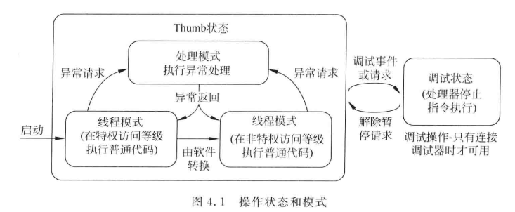
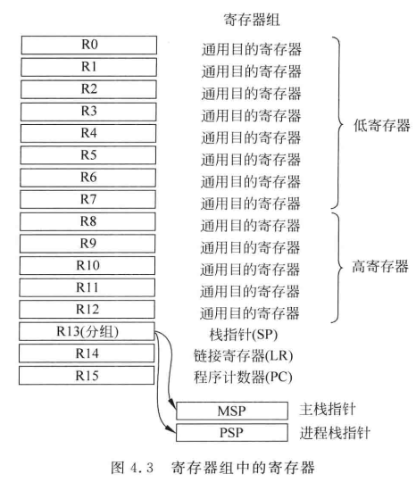
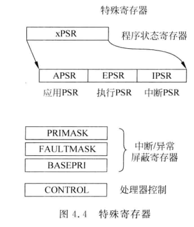

# 4  第四章 架构

## 4-2 编程模型

### 4-2-1 操作模式

#### Thumb指令和状态：

- ARM架构中的指令集。混合16位和32位指令，大约7成是16位指令。

- <u>Thumb状态</u>就是执行Thumb指令的运行模式。Cortex-M处理器不支持ARM指令集（32位指令集），所以没有ARM状态。Thumb指令能在有限的空间内获得更高的代码密度。

#### 特权访问等级：

Cortex-M处理器启动时默认处于特权访问等级，此时可以访问处理器中的所有资源。通过软件可以切换到非特权访问等级。只有异常请求（中断）可以从非特权访问等级转换到特权访问等级。

#### 线程模式：

执行普通的程序代码的模式。可以处于特权访问等级或非特权等级。

#### 处理模式：

执行中断服务程序ISR的模式。始终处于特权访问等级。

---

### 4-2-2 寄存器

#### 加载-存储架构：

对于ARM架构的处理器，如果要处理存储器里的数据，首先要将其加载到寄存器组中的寄存器中，处理完后，如果有必要，还要写回存储器中。这就是“加载-存储架构”。

#### Cortex-M3/M4中的寄存器

- R0到R12通用目的寄存器，其中R0到R7低寄存器。许多16位指令只能访问低寄存器，高寄存器可用于32位指令。R0-R12初始值是未定义的。

- SP：①MSP主栈指针是默认的栈指针，处理器处于处理模式时会使用MSP。PSP只能用于线程模式。②MSP和PSP都是32位的，不过最低两位总是为0。③PUSH和POP指令也是32位。

- LR：①用于保存调用函数或子程序时的返回地址。相当于锚点，让处理器知道执行完函数、子程序后要回到哪里。②如果函数需要调用另一个函数/子程序，那么需要将LR的值保存在栈中。③异常处理期间会被自动更新为异常返回数值`EXC_RETURN`。

- PC：存储当前正在执行的指令地址。LSB（最低有效位）置0时目标地址时ARM状态，置1时目标地址是thumb状态。

---

### 4-2-3 特殊寄存器

#### 程序状态寄存器

- 特殊寄存器未经过存储器映射，使用MRS和MSR指令来访问。如：

- - `MRS <reg>, <special_reg>    ; 将特殊寄存器读入寄存器`和`MSR <special_reg>, <reg>  ; 将寄存器值写入特殊寄存器`。

- 软件代码无法直接使用MRS或MSR直接访问EPSR。

- IPSR是只读的。

#### CONTROL寄存器

- 用于栈指针的选择，线程模式的访问等级。

- 未使用嵌入式OS的简单应用，无需修改CONTROL寄存器，整个应用运行在特权访问等级且只是用MSP（主栈指针）。
