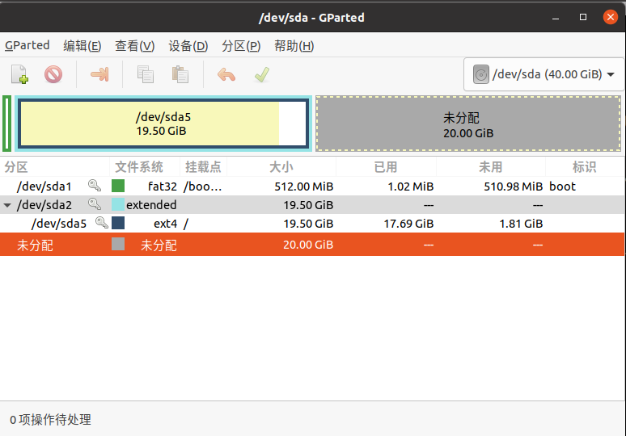
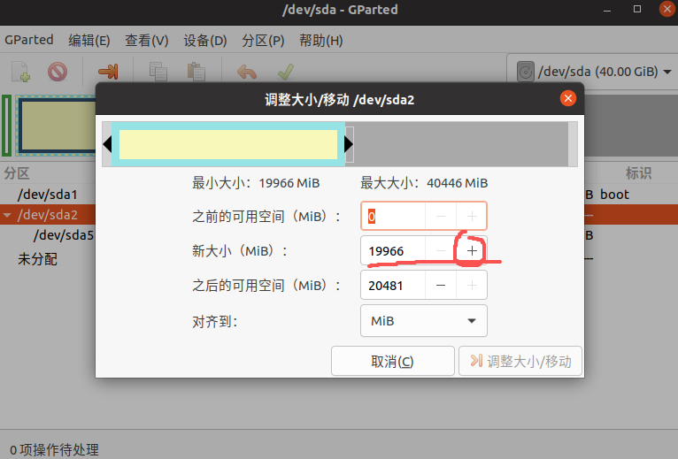
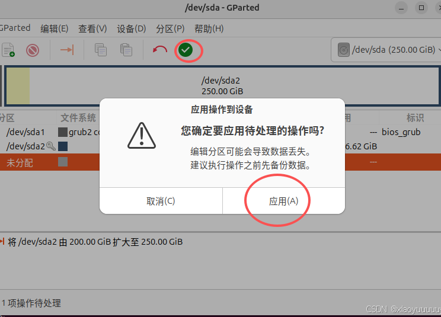
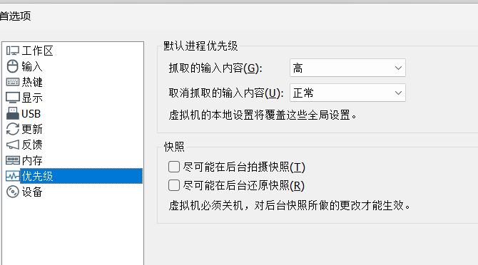
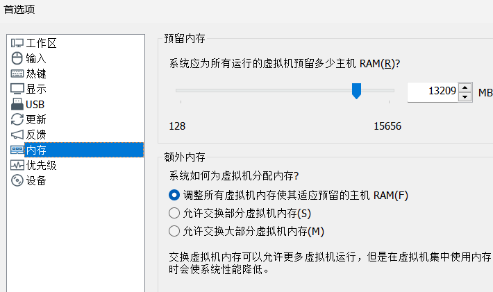

# 1 扩展磁盘空间

首先关机ubuntu，然后在VMware中增加ubuntu的磁盘空间。

进入ubuntu，使用gparted工具扩展空间（先安装）：

```
sudo apt-get install gparted
sudo gparted
```

然后会出现GParted的界面：



然后右键点击/dev/sda5（是**sda5**），选择“调整大小/移动”，即可增加磁盘空间，然后点击右下角“调整大小/移动”



然后点击绿色的勾->应用->关闭，完成。



# 2 ubuntu卡顿

先停止Ubuntu。

- 在VMWare编辑虚拟机设置-处理器：设置处理器数量2&内核数量2，或处理器数量1内核数量4。

- 编辑虚拟机设置-声卡-移除。

- VMWare-编辑-首选项-优先级：如图设置



- VMWare-编辑-首选项-内存：如图设置

