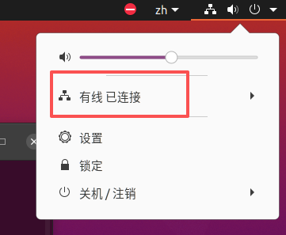
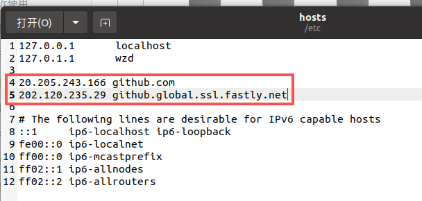

# 1 右上角网络图标消失（已解决）

## 1-1 问题：

如图，这个“有线 已连接”消失的情况：



## 1-2 解决方法

ctrl+alt+T打开终端，输入命令：

```c
sudo nmcli network off
sudo nmcli network on
```

即禁用网络再开启网络，搞定。

# 2 使用 git clone时无法访问github

终端输入`sudo gedit /etc/hosts`打开hosts文件，或者直接在文件夹里找到/etc/hosts，打开。



在hosts文件里加上这两行，保存关闭。

终端输入`sudo /etc/init.d/network-manager restart`，重启网络，解决。