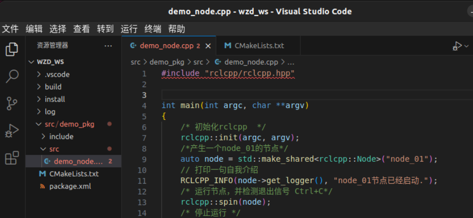

# 解决VSCode编写ROS2代码时include报错



如图，即使`colcon build`能正常编译，`ros2 run`也能正常运行节点，但VScode里还是有红色波浪线。

## 解决方法

- 在工作空间根目录下（我这里就是`~/wzd_ws/`），运行该指令：`colcon build --cmake-args -DCMAKE_EXPORT_COMPILE_COMMANDS=ON`。

- 在VScode中按`Ctrl + Shift + P`，找到`C/C++: Edit Configurations(json)，此时会弹出c_cpp_properties.json文件。

- 如下。①在includePath下增加ros的include路径。humble要改成对应的ros版本。②增加compileCommands，指向build/下的.json文件。

```json
{
    "configurations": [
        {
            "name": "Linux",
            "includePath": [
                "${workspaceFolder}/**",
                "/opt/ros/humble/include/**"
            ],
            "defines": [],
            "compilerPath": "/usr/bin/gcc",
            "cStandard": "c17",
            "cppStandard": "gnu++17",
            "intelliSenseMode": "linux-gcc-x64",
            "compileCommands":"${workspaceFolder}/build/compile_commands.json"
        }
    ],
    "version": 4
}
```
